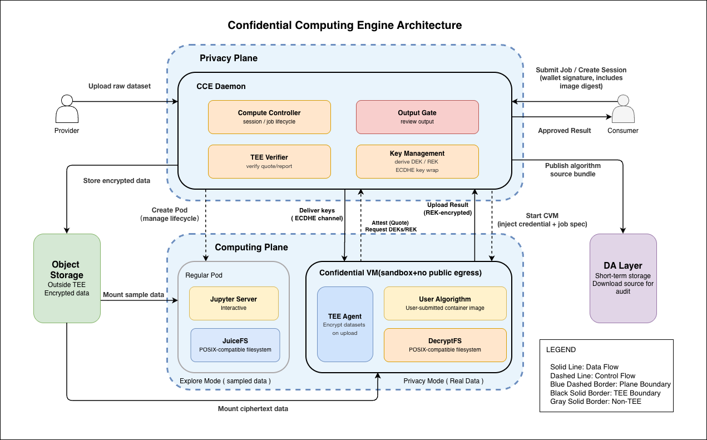

# Architecture

_Author: Dylan, Avinasi Labs_

This page describes the cce4long architecture. It traces how data moves from provider upload to consumer output, passing through two TEE planes and multiple protection layers along the way.

## Privacy Plane — `cced`

The Privacy Plane runs as a single daemon process, `cced` (Confidential Computing Engine daemon), inside a TEE. It is the engine's sole API entry point — data providers, consumers, and Computing Plane CVMs all interact with `cced`'s HTTP API. Internally it composes four modules:

- **Key Manager**: derives per-dataset DEKs and per-job REKs from a hardware-bound root key. Handles ECDHE key wrapping for secure delivery to CVMs.
- **Compute Controller**: manages CVM lifecycle, verifies measurement whitelists, checks on-chain rental status, and issues Job Credentials that grant a CVM access to specific datasets.
- **Output Gate**: reviews computation results before releasing them to consumers. Issues signed Result Manifests for approved outputs.
- **TEE Verifier**: validates TDX/SEV attestation reports and confirms REPORTDATA bindings.

Data encryption (AES-256-GCM using DEKs from Key Manager) is handled as internal business logic within `cced` — not a separate module.

## Computing Plane

The Computing Plane runs consumer workloads. It operates in two modes:

**Explore Mode** uses a Kubernetes pod with a JuiceFS client that mounts desensitized data. The consumer gets a JupyterLab session with outbound network access. No TEE is needed because the data carries no confidentiality requirement.

**Privacy Mode** provisions an independent Confidential VM (Intel TDX) per job. Inside the CVM, `tee-agent` is the single entry process that orchestrates two internal modules:

- **DecryptFS**: mounts a two-layer FUSE stack. JuiceFS fetches encrypted chunks from object storage; a Decrypt FUSE layer decrypts each read in TEE memory using the dataset's DEK. Consumer code reads plaintext from a standard POSIX path.
- **Executor**: manages the algorithm container lifecycle — pulls the image, enforces container isolation, and collects output.

The CVM has no outbound network. `tee-agent` is the only process that communicates with `cced`. After the job finishes, `tee-agent` submits output to `cced`'s Output Gate and the CVM is destroyed.

## Trust model

The Privacy Plane never trusts the Computing Plane. Every interaction requires cryptographic verification:

1. **Identity**: the CVM's measurement must match a registered whitelist entry.
2. **Authorization**: the CVM must present a valid Job Credential signed by `cced`.
3. **Integrity**: the attestation report must carry a hardware TEE signature.

Only after all three checks pass does `cced` release DEKs or accept results. The consumer's wallet private key never enters a CVM. `cced` never sees consumer code or output until Output Gate review.

## End-to-end flow

1. **Upload**: Provider uploads data to `cced`. The daemon encrypts it with a per-dataset DEK and stores ciphertext to object storage.
2. **Authentication**: Consumer authenticates with a wallet signature (EIP-4361). `cced` verifies rental status on-chain.
3. **Credential issuance**: `cced` issues a one-time Job Credential and provisions a CVM.
4. **Attestation**: `tee-agent` generates a TDX attestation report binding an ephemeral ECDHE public key to hardware measurements. `cced` verifies the report and delivers DEKs + REK over an ECDHE-encrypted channel.
5. **Computation**: DecryptFS mounts the dataset. Consumer code reads plaintext from a POSIX path. The job runs inside an isolated container.
6. **Result submission**: `tee-agent` encrypts output with the REK and submits it to `cced`'s Output Gate.
7. **Review and delivery**: If the risk score is below threshold, the result is released immediately. Otherwise, human review is triggered using the algorithm source from the DA layer. The consumer downloads the encrypted result and decrypts it with the REK.

## DA Layer

When a consumer submits an algorithm for Privacy Mode, the source bundle, lockfile, and Dockerfile are stored in the DA Layer (Celestia). The image digest and source hash are recorded on-chain permanently. If the Output Gate flags a result for human review, the reviewer retrieves the source from the DA layer and rebuilds the image to verify the digest. See [Algorithm auditability](algorithm-auditability.md) for details.

## Why two planes

A single TEE that manages both keys and workloads would couple availability requirements. `cced` must be always-on — consumers need to start jobs at any time. The Computing Plane is ephemeral by design — CVMs spin up and tear down per job. Separating them also limits blast radius: compromising a CVM exposes only the DEKs for that job's datasets, not the root key.
