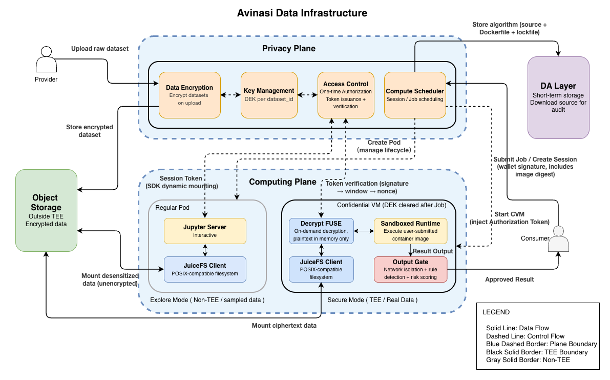

# Architecture walkthrough

_Author: Dylan, Avinasi Labs_

This page walks through the Avinasi Data Infrastructure diagram. It traces how data moves from provider upload to consumer output, passing through two TEE planes and multiple protection layers along the way.

## Object Storage

Data providers encrypt datasets with a per-dataset DEK and upload ciphertext to **Object Storage** (S3 or equivalent). The storage layer never sees plaintext. Encrypted data sits here until a CVM fetches it for computation.

## Privacy Plane

The **Privacy Plane** runs on Phala dstack and manages three concerns:

- **Data Encryption**: derives and holds per-dataset DEKs. Keys never leave TEE memory in plaintext.
- **Key Management**: maintains the root KEK and derives DEKs deterministically by dataset ID.
- **Access Control**: verifies wallet signatures, checks on-chain rental status, and issues one-time **Authorization Tokens** that grant a CVM access to specific datasets.
- **Compute Controller**: manages CVM lifecycle, image configuration, measurement registration, and token injection for Secure Mode jobs.

When a consumer submits a job, the Privacy Plane verifies identity and rental, signs an Authorization Token, and hands it to the Computing Plane. After the CVM passes Remote Attestation (TDX/SEV verification), the Privacy Plane delivers DEKs over an ECDHE-encrypted channel.

## Computing Plane

The **Computing Plane** runs consumer workloads in two modes:

**Explore Mode** uses a Kubernetes pod with a **JuiceFS Client** that mounts desensitized data. The consumer gets a JupyterLab session with outbound network access. No TEE is needed because the data carries no confidentiality requirement.

**Secure Mode** provisions an independent **Confidential VM** (Intel TDX) per job. Inside the CVM, two FUSE layers work together:

- **JuiceFS** fetches encrypted chunks from Object Storage and caches ciphertext locally.
- **Decrypt FUSE** sits above JuiceFS, decrypts each read in TEE memory using the dataset's DEK, and returns plaintext to consumer code.

The CVM has no outbound network. After the job finishes, all output passes through the **Output Gate** before the consumer can access it. The CVM is then destroyed.

## DA Layer

When a consumer submits an algorithm for Secure Mode, the source bundle, lockfile, and Dockerfile are stored in the **DA Layer** (Celestia). The image digest and source hash are recorded on-chain permanently. If the Output Gate flags a result for human review, the reviewer retrieves the source from the DA layer and rebuilds the image to verify the digest.

## End-to-end flow

1. Provider encrypts data with a per-dataset DEK and uploads ciphertext to Object Storage.
2. Consumer authenticates with a wallet signature. The Privacy Plane verifies rental status on-chain.
3. Privacy Plane issues an Authorization Token and starts a CVM.
4. CVM generates a TDX attestation report. Privacy Plane verifies it and delivers DEKs over ECDHE.
5. Decrypt FUSE mounts the dataset. Consumer code reads plaintext from a POSIX path.
6. Job completes. Output passes through the Output Gate.
7. If the risk score is below threshold, the consumer gets the result. Otherwise, human review is triggered using the algorithm source from the DA layer.
